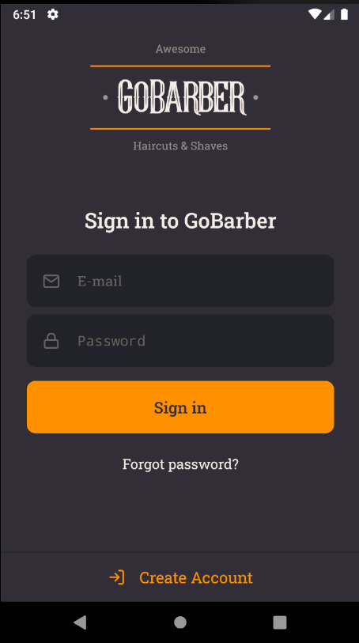
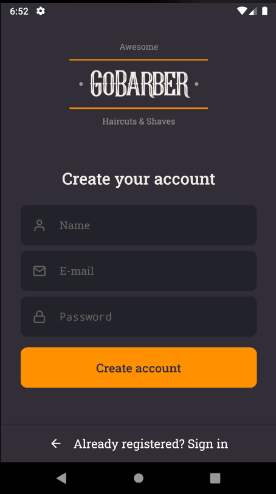
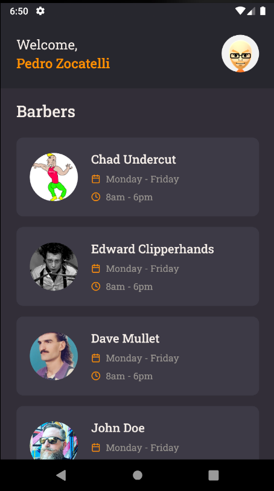
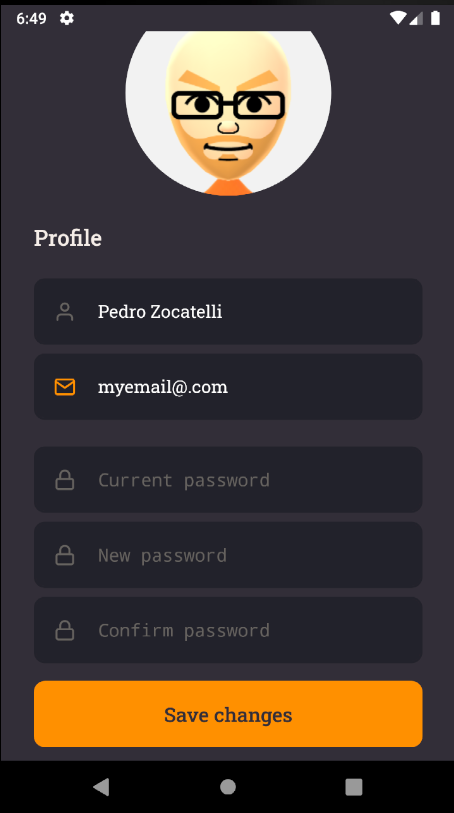

<h1 align="center">
  
</h1>

<p align="center" >
  <a href="#framed_picture-preview"> 🖼️ Preview</a> |
  <a href="#construction-project"> 🚧 Project</a> |
  <a href="#rocket-technologies"> 🚀 Technologies</a> |
  <a href="#zap-getting-started"> ⚡ Getting started</a>
</p>


<h2 align="center">The best haircut and beard trim of your life!</h2>


## :framed_picture: Preview

<div align="center" >
  
</div>
<div align="center" >
  
</div>
<div align="center" >
  
</div>
<div align="center" >
  
</div>


## :construction: Project

This is the GoBarber App Interface, which is to be used by the costumer, in which they can schedule appointments and make changes to their profile.


[API](https://github.com/pedrozocatelli/gobarber-api)

## :rocket: Technologies

- [React Native](https://github.com/facebook/react-native)
- [TypeScript](https://www.typescriptlang.org/)
- [Axios](https://github.com/axios/axios)
- [Styled Components](https://styled-components.com/)

## :zap: Getting started
```sh
$ git clone git@github.com:pedrozocatelli/gobarber-app.git
$ cd gobarber-app
$ yarn android && yarn dev
$ OR (If using iOS)
$ yarn ios && yarn dev

```
